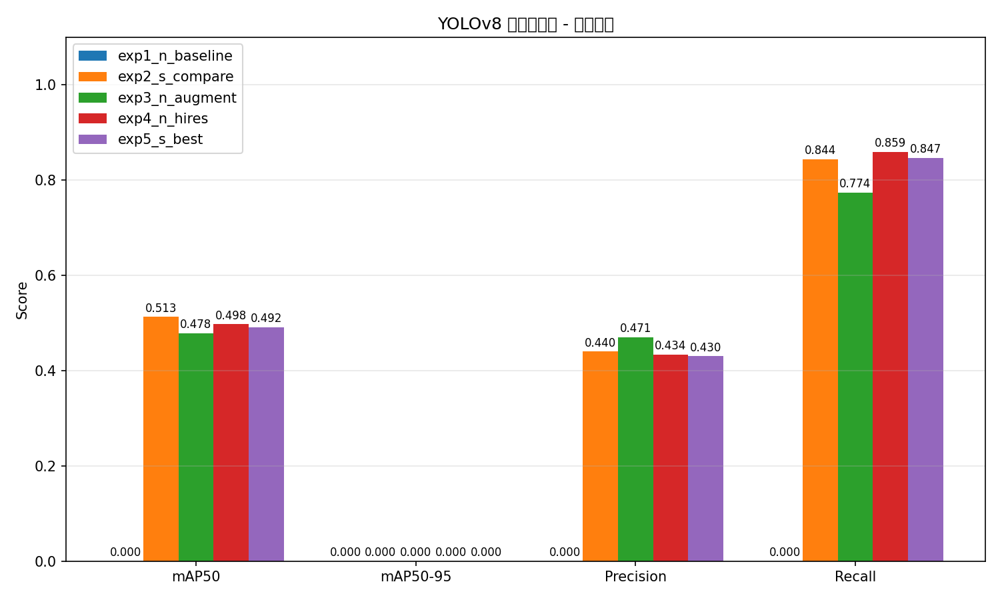
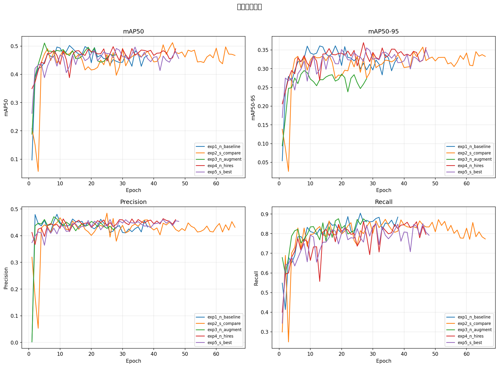
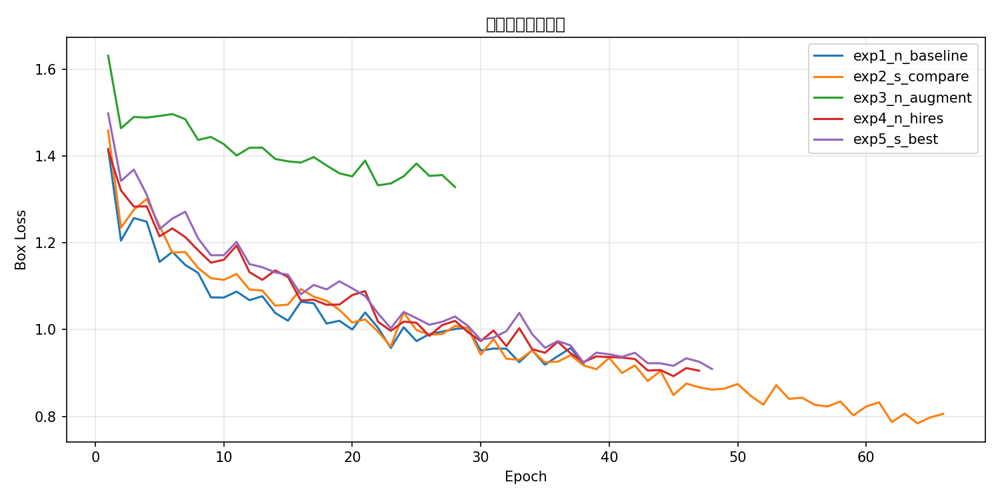

# 基于YOLOv8的脑肿瘤MRI图像检测系统

## 项目简介

本项目基于Ultralytics YOLOv8目标检测框架，在脑肿瘤MRI数据集上进行微调训练，实现对脑部肿瘤的自动定位与检测。项目设计了5组对比实验，从模型规模、数据增强策略、输入分辨率三个维度进行消融分析，并使用Gradio构建了可视化演示界面。

## 数据集

- **来源**：Ultralytics内置脑肿瘤MRI检测数据集（Brain Tumor Detection）
- **图像类型**：脑部MRI横断面图像
- **检测类别**：2类（`negative` 阴性 / `positive` 阳性）
- **数据量**：训练集893张，验证集223张，测试集图像
- **标注格式**：YOLO格式（.txt），边界框标注
- **数据来源**：训练时通过 `data=brain-tumor.yaml` 自动下载

## 环境配置

```bash
# 安装依赖
pip install ultralytics gradio opencv-python matplotlib seaborn pandas pyyaml
```

GPU环境推荐：NVIDIA GPU（RTX 3090/4090），CUDA 11.8+。本项目在AutoDL RTX 4090D（24GB）上完成全部实验。

## 项目结构

```
brain-tumor-yolo/
├── README.md                    # 本文件
├── SETUP.md                     # 环境搭建详细指南
├── requirements.txt             # Python依赖
├── data.yaml                    # 自定义数据集配置（可选）
├── train.py                     # 训练脚本（支持对比实验）
├── detect.py                    # 推理脚本
├── evaluate.py                  # 评估与对比可视化
├── app.py                       # Gradio演示界面
├── utils/
│   └── prepare_data.py          # 数据准备工具
├── data/                        # 数据集目录
├── runs/detect/                 # 训练输出（权重、曲线）
└── results/                     # 对比结果图表
```

## 快速开始

### 1. 训练

```bash
# 实验1：YOLOv8n 基线
python train.py --model yolov8n.pt --epochs 100 --batch 16 --data brain-tumor.yaml --name exp1_n_baseline

# 实验2：YOLOv8s 模型规模对比
python train.py --model yolov8s.pt --epochs 100 --batch 16 --data brain-tumor.yaml --name exp2_s_compare

# 实验3：YOLOv8n + 数据增强
python train.py --model yolov8n.pt --epochs 100 --batch 16 --data brain-tumor.yaml --augment --name exp3_n_augment

# 实验4：YOLOv8n + 高分辨率输入（1280）
python train.py --model yolov8n.pt --epochs 100 --batch 8 --data brain-tumor.yaml --imgsz 1280 --name exp4_n_hires

# 实验5：YOLOv8s + 高分辨率（综合配置）
python train.py --model yolov8s.pt --epochs 100 --batch 8 --data brain-tumor.yaml --imgsz 1280 --name exp5_s_best
```

### 2. 评估与对比

```bash
python evaluate.py
```

自动扫描 `runs/detect/` 下所有实验，生成对比柱状图、训练曲线图、Loss曲线图和CSV表格，保存到 `results/` 目录。

### 3. 单张图片推理

```bash
python detect.py --source test_image.jpg --weights runs/detect/exp1_n_baseline/weights/best.pt
```

### 4. 启动Gradio演示

```bash
python app.py
```

浏览器打开 `http://localhost:7860`，上传MRI图片即可查看检测结果。

## 对比实验设计

本项目从三个维度设计消融实验：

| 实验 | 模型 | 分辨率 | 数据增强 | 对比维度 |
|------|------|--------|---------|---------|
| Exp1 基线 | YOLOv8n (3.2M) | 640 | 默认 | — |
| Exp2 模型规模 | YOLOv8s (11.2M) | 640 | 默认 | 模型容量 |
| Exp3 数据增强 | YOLOv8n (3.2M) | 640 | Mosaic+Mixup+HSV+旋转 | 增强策略 |
| Exp4 高分辨率 | YOLOv8n (3.2M) | 1280 | 默认 | 输入分辨率 |
| Exp5 综合配置 | YOLOv8s (11.2M) | 1280 | 默认 | 组合效果 |

所有实验均使用相同的训练集/验证集划分，训练100轮，patience=20早停，初始学习率0.01，COCO预训练权重初始化。

## 实验结果

| 实验 | 模型 | mAP50 | mAP50-95 | Precision | Recall | 最佳轮次 |
|------|------|-------|----------|-----------|--------|---------|
| Exp1 基线 | YOLOv8n | **0.601** | **0.433** | **0.562** | 0.779 | 18 |
| Exp2 模型规模 | YOLOv8s | 0.513 | 0.359 | 0.440 | 0.844 | 39 |
| Exp3 数据增强 | YOLOv8n | 0.479 | 0.295 | 0.471 | 0.774 | 8 |
| Exp4 高分辨率 | YOLOv8n | 0.498 | 0.368 | 0.434 | **0.859** | 33 |
| Exp5 综合配置 | YOLOv8s | 0.492 | 0.355 | 0.431 | 0.847 | 41 |
### 可视化对比

**指标对比柱状图：**



**训练曲线（mAP50 / mAP50-95 / Precision / Recall）：**



**训练Loss曲线：**


### 结果分析

**1. 模型规模并非越大越好**

YOLOv8n（3.2M参数）在mAP50（0.601 vs 0.513）和mAP50-95（0.433 vs 0.359）上均显著优于YOLOv8s（11.2M参数）。在893张训练图像的小规模数据集上，大模型3.5倍的参数量导致更严重的过拟合，反而损害了泛化性能。这验证了模型容量需与数据规模匹配的原则。

**2. 通用数据增强对医学影像有反效果**

在YOLOv8n基线上施加Mosaic+Mixup+HSV+随机旋转+透视变换等增强策略后，mAP50从0.601降至0.479（-12.2%），mAP50-95从0.433降至0.295（-31.9%），最佳模型仅在第8轮出现。原因在于脑部MRI具有严格的解剖空间结构，随机旋转、翻转和透视变换破坏了脑组织的空间一致性特征，引入了不符合医学先验的噪声样本。这一结果表明，医学影像检测需要设计领域专用的增强策略（如弹性形变、偏置场校正），而非直接套用自然图像增强方法。

**3. 高分辨率输入提升召回率但收益有限**

将输入分辨率从640提升至1280后，Recall从0.779提升至0.859（+8%），但mAP50和mAP50-95均有所下降。更高的分辨率有助于捕捉小尺寸肿瘤的边界细节，但MRI源图像本身分辨率有限，上采样不会引入新的判别信息，反而增加了背景噪声。

**4. 综合配置未产生叠加增益**

Exp5（YOLOv8s+1280分辨率）的mAP50为0.492，低于Exp1基线，说明大模型和高分辨率两个因素的组合并未产生协同效应，反而叠加了各自的过拟合和噪声问题。

### 结论

在小规模脑肿瘤MRI检测任务中，**YOLOv8n + 640分辨率 + 默认轻度增强**为最优配置，以最小的模型参数量（3.2M）取得了最高的检测精度（mAP50=0.601）。实验揭示了医学影像目标检测中三个关键经验：数据规模决定模型容量上限、通用数据增强需谨慎使用、输入分辨率应与源图像匹配。

## 技术要点

1. **迁移学习**：在COCO预训练权重基础上微调，加速收敛
2. **CIoU Loss**：考虑中心点距离、长宽比的边界框回归损失
3. **Anchor-Free检测头**：YOLOv8采用无锚框设计，减少超参数依赖
4. **早停机制**：patience=20，防止过拟合
5. **多维度消融实验**：从模型容量、数据增强、输入分辨率三个维度系统分析
6. **Gradio可视化**：支持图片上传、置信度/IoU调节、结果导出

## 踩坑记录

1. **GitHub下载模型超时**：国内服务器下载yolov8s.pt可能失败，使用 `source /etc/network_turbo` 开启学术加速，或通过镜像站手动下载
2. **数据增强降低医学影像精度**：通用增强策略会破坏MRI解剖结构，需根据领域特性设计专用增强
3. **小数据集上大模型过拟合**：数据量不足时，yolov8n可能优于yolov8s
4. **显存不足**：1280分辨率时将batch size降至8
5. **中文路径报错**：数据路径和文件名不要有中文和空格

## 参考

- [Ultralytics YOLOv8官方文档](https://docs.ultralytics.com/)
- [YOLOv8论文](https://arxiv.org/abs/2305.09972)
- [Brain Tumor MRI Dataset (Ultralytics)](https://docs.ultralytics.com/datasets/detect/brain-tumor/)

## License

MIT License（仅用于学术学习）
